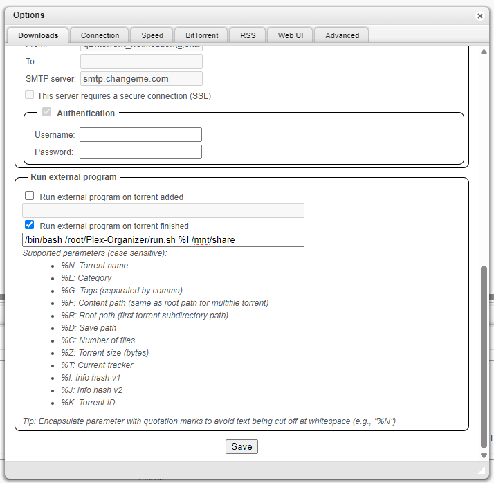

# Plex Organizer

Plex Organizer is a Python-based utility designed to help manage and organize media files for Plex Media Server. It automates tasks such as renaming files, deleting unwanted files, moving directories, and cleaning up empty folders.

## Features

- **Torrent Removal**: Removes torrents from the client after processing.
- **File Renaming**: Automatically renames media files based on predefined rules for TV shows and movies.
- **Unwanted File Deletion**: Removes unnecessary files from specified directories.
- **Directory Management**: Moves directories to their appropriate locations and deletes empty directories.
- **Customizable Directories**: Supports separate directories for TV shows and movies.

### Example Directory Structure

Below is an example of the directory structure that Plex Organizer processes:

```plaintext
<start_directory>/
├── movies/
│   ├── Venom.2018.BluRay.x264-[YTS.AM].mp4
│   ├── Venom.Let.There.Be.Carnage.2021.1080p.BluRay.x264.AAC5.1-[YTS.MX].mp4
│   ├── Warcraft.2016.1080p.BluRay.x264-[YTS.AG].mkv
│   ├── 1917 (2019) [1080p] [BluRay] [5.1] [YTS.MX]/
│   │   └── Subs/
│   │       ├── English.srt
│   │       └── Spanish.srt
│   ├── 2 Fast 2 Furious (2003) [1080p]/
│   │   └── Subs/
│   │       └── French.srt
│   ├── 6 Underground (2019) [WEBRip] [1080p] [YTS.LT]/
│   │   ├── 6 Underground (2019).mp4
│   │   └── Subs/
│   │       ├── Turkish.tur.srt
│   │       ├── Norwegian.nor.srt
│   │       └── Danish.dan.srt
│   └── random_file.txt
├── tv/
│   ├── Black Bird/
│   │   ├── S01E01.mp4
│   │   ├── S01E02.mp4
│   │   └── unwanted_file.txt
│   ├── Colony/
│   │   ├── S01E01.mp4
│   │   ├── S01E02.mp4
│   │   └── extra_file.txt
│   └── Loki/
│       ├── S01E01.mp4
│       └── S01E02.mp4
```

And what it looks like afterwards:

```plaintext
<start_directory>/
├── movies/
│   ├── 1917 (2019) 1080p.mp4
│   ├── 2 Fast 2 Furious (2003) 1080p.mp4
│   ├── 6 Underground (2019) 1080p.mp4
│   ├── Venom (2018).mp4
│   ├── Venom Let There Be Carnage (2021) 1080p.mp4
│   └── Warcraft (2016) 1080p.mkv
├── tv/
│   ├── Black Bird/
│   │   └── Season 1/
│   │       ├── Black Bird S01E01.mp4
│   │       └── Black Bird S01E02.mp4
│   ├── Colony/
│   │   └── Season 1/
│   │       ├── Colony S01E01.mp4
│   │       └── Colony S01E02.mp4
│   └── Loki/
│       └── Season 1/
│           ├── Loki S01E01.mp4
│           └── Loki S01E02.mp4
```

## Requirements

- Python 3.x
- Dependencies listed in `requirements.txt`

## Installation

1. Clone the repository:

   ```bash
   git clone https://github.com/Toomas633/Plex-Organizer.git
   cd Plex-Organizer
   ```
2. Set up a virtual environment (optional but recommended):

   ```bash
    python -m venv venv
    source venv/bin/activate
   ```
3. Install dependencies:

   ```bash
   pip install -r requirements.txt
   ```

## Usage

Run the script with the following command:

```bash
/bin/bash <path_to_script>/run.sh <torrent_hash> <start_directory>
```

Arguments:

- <torrent_hash>: The hash of the torrent to be removed (use "test" for testing purposes). Argument %I in qBittorrent ui.
- <start_directory>: The base directory containing the tv and movies subdirectories.

Example:



This will remove the torrent with the given hash and process the directories /mnt/media/tv and /mnt/media/movies.

## Contributing

Contributions are welcome! Please follow these steps:

Fork the repository.
Create a new branch for your feature or bug fix.
Commit your changes and push the branch.
Open a pull request.

## License

This project is licensed under the [GNU General Public License v3.0](LICENSE).

## Issues and Feature Requests

If you encounter any issues or have feature requests, please use the GitHub Issues page.

---

Happy organizing!
