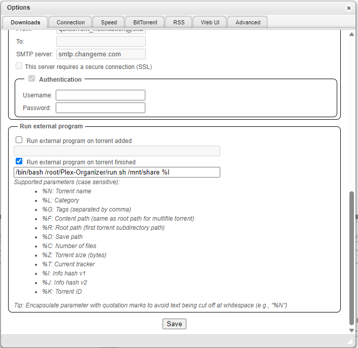

# Plex Organizer

- [Plex Organizer](#plex-organizer)
- [Features](#features)
  - [Example Directory Structure](#example-directory-structure)
- [Requirements](#requirements)
- [Installation](#installation)
- [Update](#update)
- [Configuration](#configuration)
- [Usage](#usage)
  - [Manual running](#manual-running)
  - [Automated running](#automated-running)
- [Dev Container (VS Code)](#dev-container-vs-code)
- [Contributing](#contributing)
- [License](#license)
- [Issues and Feature Requests](#issues-and-feature-requests)

Plex Organizer is a Python-based utility designed to help manage and organize media files for Plex Media Server. It automates tasks such as renaming files, deleting unwanted files, moving directories, and cleaning up empty folders.

**_NB!! Any data loss is not on me but you can still report any bugs or faults you find in issues_**

## Features

- **Torrent Removal**: Removes torrents from the client after processing.
- **File Renaming**: Automatically renames media files based on predefined rules for TV shows and movies.
- **Unwanted File Deletion**: Removes unnecessary files/folders from specified directories.
- **Directory Management**: Moves directories to their appropriate locations and deletes empty directories.
- **Customizable Directories**: Supports separate directories for TV shows and movies.
- **Handle Plex:** Handles plex directories and optimized versions.
- **Audio language tagging (optional)**: If enabled, detects missing audio track languages and writes ISO 639-2 tags into the container metadata (uses `ffprobe`/`ffmpeg` + `faster-whisper`).
- **Subtitle embedding (optional)**: If enabled, embeds external subtitles into the video file and tags subtitle language/type metadata (uses `ffprobe`/`ffmpeg` + `langdetect`).
- **Config file:** Ini file for common configuration options that can be set, disabled or enabled (_beware, some settings might not do anything if already run and info removed from file names, for example turning off quality inclusion and then enabling it_)

Notes:

- Cleanup is intentionally aggressive: only video files (`.mkv`, `.mp4`), in-progress qBittorrent files (`.!qB`), and the organizer index file (`.plex_organizer.index`) are kept. Subtitle files/folders (e.g. `Subs/`, `Subtitles/`) are removed.
- The organizer keeps a per-library index (`.plex_organizer.index`) so already-processed files can be skipped on future runs.
- If qBittorrent torrent removal is enabled (by providing a torrent hash), the qBittorrent Web API must be reachable and credentials must be set.

### Example Directory Structure

<div style="display: flex; gap: 10px;">
<div style="flex: 2;">
Example of the directory structure that Plex Organizer processes:
<pre>
<code>
start_directory/
├── movies/
│   ├── Venom.2018.BluRay.x264-[YTS.AM].mp4
│   ├── Warcraft.2016.1080p.BluRay.x264-[YTS.AG].mkv
│   ├── 1917 (2019) [1080p] [BluRay] [5.1] [YTS.MX]/
│   │   └── Subs/
│   │       ├── English.srt
│   │       └── Spanish.srt
│   ├── 2 Fast 2 Furious (2003) [1080p]/
│   │   └── Subs/
│   │       └── French.srt
│   ├── 6 Underground (2019) [WEBRip] [1080p] [YTS.LT]/
│   │   ├── 6 Underground (2019).mp4
│   │   └── Subs/
│   │       ├── Turkish.tur.srt
│   │       ├── Norwegian.nor.srt
│   │       └── Danish.dan.srt
│   └── random_file.txt
└── tv/
    ├── Black Bird/
    │   ├── S01E01.mp4
    │   ├── S01E02.mp4
    │   └── unwanted_file.txt
    ├── Colony/
    │   ├── S01E01.mp4
    │   ├── S01E02.mp4
    │   └── extra_file.txt
    └── Loki/
        ├── S01E01.mp4
        └── S01E02.mp4
</pre>
</code>
</div>
<div style="flex: 1;">
And what it looks like afterwards:
<pre>
<code>
start_directory/
├─ movies/
│  ├── 1917 (2019) 1080p.mp4
│  ├── 2 Fast 2 Furious (2003) 1080p.mp4
│  ├── 6 Underground (2019) 1080p.mp4
│  ├── Venom (2018).mp4
│  └── Warcraft (2016) 1080p.mkv
└─ tv/
   ├── Black Bird/
   │   └─ Season 1/
   │     ├── Black Bird S01E01.mp4
   │     └── Black Bird S01E02.mp4
   ├── Colony/
   │   └─ Season 1/
   │     ├── Colony S01E01.mp4
   │     └── Colony S01E02.mp4
   └── Loki/
      └── Season 1/
         ├── Loki S01E01.mp4
         └── Loki S01E02.mp4
</pre>
</code>
</div>
</div>

## Requirements

- Python 3.x
- Dependencies listed in `requirements.txt`
- `ffmpeg`/`ffprobe` on PATH (required if `enable_audio_tagging = true` and/or `enable_subtitle_embedding = true`)

## Installation

1. Clone the repository:

   ```bash
   git clone https://github.com/Toomas633/Plex-Organizer.git
   cd Plex-Organizer
   ```

2. Install dependencies (recommended):

```bash
bash ./install.sh
```

Or, to upgrade already-installed dependencies:

```bash
bash ./install.sh --upgrade
```

## Update

To update to the latest version just run update.sh (it will also run `install.sh` afterwards).

```bash
./update.sh
```

## Configuration

All user configuration is handled in `config.ini`.

The file is auto-managed on startup:

- Missing required sections/options are added.
- Unknown options inside known sections are removed.

Key sections:

- `[qBittorrent]`
  - `host`: Base URL for the Web API (default `http://localhost:8081`). Used for torrent removal.
  - `username`: Username for qbittorrent web api
  - `password`: Password to authenticate with
- `[Settings]`
  - `delete_duplicates`: If `true`, deletes source files when the destination already exists.
  - `include_quality`: If `true`, appends quality like `1080p` to renamed files.
  - `capitalize`: If `true`, title-cases show/movie names.
  - `cpu_threads`: Limits CPU parallelism for some processing steps.
- `[Logging]`
  - `enable_logging`: If `true`, logs errors to a log file
  - `log_file`: Name of the log file
  - `clear_log`: If `true`, log file is cleared on each run of the script
  - `timestamped_log_files`: If `true`, log files are timestamped and put to logs folder
  - `level`: Either `INFO` by default or `DEBUG` if Debug log rows are needed
- `[Audio]`
  - `enable_audio_tagging`: If `true`, runs audio language tagging after moves.
  - `whisper_model_size`: Whisper model size for `faster-whisper` (default `tiny`).
- `[Subtitles]`
  - `enable_subtitle_embedding`: If `true`, embeds external subtitles and tags metadata before subtitle files/folders are removed.

**NB!!** Make sure the qBittorrent `host` is correct. Torrent removal is best-effort: failures are logged and processing continues.

## Usage

Start directory should have either...

1. The folders for movies and tv as shown in the example. Show names are taken from the parent folder inside tv folder and only episode, season and quality are taken from the file names.
2. Just the given torrent save path folder (%D option in qBittorrent)

### Manual running

To run manually just go to the Plex-Organizer cloned or downloaded folder and run:

```bash
./run.sh <start_directory>
```

### Automated running

Add this command to qBittorrent options under "Run external program on torrent finished":

```bash
/bin/bash <path_to_script>/run.sh <start_directory> <torrent_hash>
```

Arguments:

- `<start_directory>`: The base directory containing the tv and movies subdirectories or %D in qBittorrent ui.
- `<torrent_hash>`: **Optional:** The hash of the torrent to be removed (omit for testing purposes or to ignore torrent automatic removal). Argument %I in qBittorrent ui.

**Be sure to put arguments between "%D" to avoid whitespace cuttofs**

Example:



For performance reasons it is recommended that **%D** is used instead of entire directory like `/mnt/share`. This way only the specific folder will be organized not entire library on each call. Putting your root directory like `/mnt/share` will remove the torrent with the given hash and process the directories `/mnt/media/tv` and `/mnt/media/movies`.

## Dev Container (VS Code)

This repo includes a VS Code Dev Container configuration.

1. Install Docker (Docker Desktop) and VS Code.
2. In VS Code: `Dev Containers: Reopen in Container`.

The container includes `ffmpeg` (for `faster-whisper`) and will create/initialize `venv/` + install `requirements.txt` on first create.
It does not auto-run `test.sh`.

For the same quick verification flow as `test.bat` (but for Linux/Dev Container), run:

```bash
bash ./test.sh
```

## Contributing

Contributions are welcome! Please follow these steps:

Fork the repository.
Create a new branch for your feature or bug fix.Commit your changes and push the branch.
Open a pull request.

## License

This project is licensed under the [GNU General Public License v3.0](LICENSE).

## Issues and Feature Requests

If you encounter any issues or have feature requests, please use the GitHub Issues page.

---

Happy organizing!
